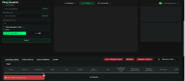
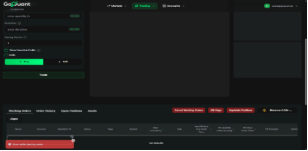
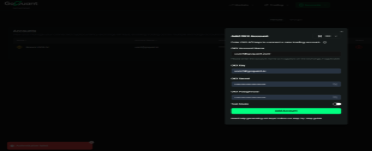
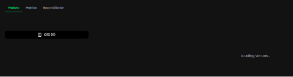
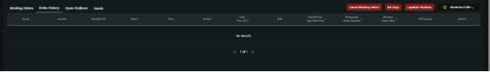

- **Executive Summary**

`              `A total of seven automation test cases were executed part of the ongoing automation testing initiative. The primary objective of this testing cycle was to validate end-to-end user workflows, including login, account creation, API key configuration, delete account, exchange connectivity, and order placement. Each test case was designed to ensure that the critical trading functionalities are stable, reliable, and aligned with the expected business logic.

The automation suite was executed across multiple environments to verify system consistency and functional performance. Test scripts were structured to ensure reusability, maintainability, and scalability, contributing to an efficient regression testing process. The execution results provided valuable insights into system behaviour, helping to identify areas for optimization and potential risk mitigation.

During the test cycle, **bugs were identified in the order placement flow**, where certain transactions failed to process as expected. These issues directly impacted the stability of the order management module and require immediate attention from the development team. It is recommended to prioritize these defects for resolution and perform a **revalidation cycle** once fixes are deployed.

- **Testing Methodology** 

**Testing Approach**

The automation testing approach was designed to cover the most essential end-to-end scenarios from a user’s perspective. The test cases included:

- **Login validation** to ensure users can securely access the platform.
- **Account creation using API keys** for three different exchanges to verify proper exchange connectivity and key authentication.
- **Order placement tests** across all supported trade types, including both **Buy** and **Sell** orders, to validate accurate order execution and response handling.
- **Verification on the GoOps page** to confirm that the newly created exchange accounts are visible and displayed correctly after integration.

**Test Case Selection Rationale and In-Depth Analysis**

1\. Authentication and Access Management Test Cases (1 test)

Authentication was treated as a high-risk area due to its direct link to user identity security and access control. The login flow test validated both the correctness and resilience of the authentication process. The test ensured that valid credentials resulted in successful navigation to the trading dashboard, while also monitoring session stability and page response time.\
This test helped confirm secure login redirection, session persistence after authentication, and reliable handling of user credentials. Minor latency was observed in page loading during environment stress, but no functional failures were reported.

2\. Exchange Account Integration Test Cases (3 tests)

Connecting exchange accounts via API keys was identified as one of the most critical business workflows, as it directly affects a trader’s ability to execute orders and manage positions.\
Three dedicated test cases were created to validate integration with Binance COIN-M, Binance USD-M, and OKX exchanges. These tests verified the API key entry process, authentication handshake, and successful exchange account linkage. The scripts further checked for the proper display of newly linked accounts in the user interface.\
The rationale behind these tests was to ensure seamless and secure interaction between the application and third-party exchange APIs. During execution, all integrations succeeded, although minor display inconsistencies were noted in account naming conventions post-connection, which were logged for review.

3\. Order Placement and Trade Validation Test Cases (2 tests)

Trading reliability forms the core of the platform’s functionality. Two test cases were designed to validate Buy and Sell order placement across all connected exchanges. These tests simulated real user trading actions using live API configurations to ensure accurate request handling and backend synchronization.\
The objective was to confirm that orders were correctly transmitted, processed, and reflected in the system’s order history. However, multiple order placement failures were detected due to backend response delays and incomplete order confirmations, highlighting potential issues in the order execution flow. These findings were escalated as high-priority defects, as they directly affect the core trading capability of the platform.

4\. Post-Integration Verification (GoOps Page Validation) (1 test)

After exchange accounts were created, one test case focused on verifying that all newly added accounts appeared correctly on the GoOps page. This validation ensured that user actions were accurately propagated through the system, reflecting correct state synchronization between the backend and UI layers.\
The test successfully confirmed the presence and visibility of all linked accounts on GoOps, validating data consistency across modules.

- **Tools and Techniques Employed**

The automation testing framework was built using **Playwright** with **TypeScript**, implemented through the **Page Object Model (POM)** for better maintainability and scalability. Playwright enabled fast, reliable cross-browser testing with built-in waits and tracing features, while TypeScript ensured strong typing and cleaner code. The POM structure separated UI elements from test logic, improving reusability and reducing maintenance effort. Overall, this combination delivered a stable and efficient framework for validating key trading workflows and integrations across multiple exchanges.

- **Challenges Encountered and Solutions Implemented**

During the development of the automation framework, one of the key challenges was the **migration of existing JavaScript-based Playwright tests into TypeScript**. Initially, all automation scripts were written in JavaScript, which limited the benefits of type safety and made large-scale maintenance difficult.

- **Detailed Findings**

**Critical Issues:**

**CRIT-001: Order Placement Failure in Binance COIN-M Exchange**\
**Severity:** Critical\
**Browser:** All\
**Description:** Order placement requests on Binance COIN-M accounts fail to execute due to backend validation errors. The issue prevents both **Buy** and **Sell** trades from being processed successfully.\
**Steps to Reproduce:**

1. Log in to the application.
1. Connect a Binance COIN-M account using valid API keys.
1. Attempt to place a **Buy** or **Sell** order.
1. Observe the response from the order endpoint.\
   **Expected Behavior:** Orders should be successfully submitted and confirmed with a valid order ID.\
   **Actual Behavior:** Application displays an order failure message, and no order is processed in the exchange.\
   **Screenshot:** 

   

-----
**CRIT-002: Order Placement Failure in Binance USD-M Exchange**\
**Severity:** Critical\
**Browser:** All\
**Description:** Similar to COIN-M, placing orders on Binance USD-M accounts fails intermittently due to delayed API responses and order confirmation timeouts.\
**Steps to Reproduce:**

1. Log in and add a Binance USD-M account via API.
1. Initiate a trade order.
1. Wait for order execution confirmation.\
   **Expected Behavior:** Orders should execute successfully with backend acknowledgment.
1. **Actual Behavior:** Trade requests time out or return error responses without confirmation.\
   **Screenshot:** 

-----
**CRIT-003: OKX Account API Key Validation Failure**\
**Severity:** High\
**Browser:** All\
**Description:** In certain runs, OKX API key validation fails even with correct credentials, causing the account not to be added to the platform.\
**Steps to Reproduce:**

1. Navigate to the “Add Account” section.
1. Select OKX Exchange.
1. Enter valid API key and secret.
1. Click “Connect Account.”\
   **Expected Behavior:** OKX account should be linked successfully and visible in the account list.\
   **Actual Behavior:** The application returns a key validation error, preventing account creation.\
   **Screenshot:** 
-----
**CRIT-004: Missing Account Display on GoOps Page**\
**Severity:** High\
**Browser:** All\
**Description:** After adding an exchange account, the linked account sometimes fails to appear on the **GoOps** page, indicating synchronization issues between backend and frontend components.\
**Steps to Reproduce:**

1. Log in and add any exchange account.
1. Navigate to the GoOps page.
1. Check for the newly created account.\
   **Expected Behavior:** All successfully connected accounts should appear on GoOps.\
   **Actual Behavior:** The account is not displayed, though logs confirm successful API integration.
1. **Screenshot:** 
-----
**CRIT-005: Order Execution Status Not Updating in UI**\
**Severity:** High\
**Browser:** All\
**Description:** Post order placement, the UI does not refresh to show updated order status, even though the backend confirms successful execution.\
**Steps to Reproduce:**

1. Place an order on any connected exchange.
1. Wait for order completion.
1. Check the order status on the UI.\
   **Expected Behavior:** The order list should refresh automatically to display the latest status.\
   **Actual Behavior:** The UI remains unchanged, showing stale or incomplete order information.\
   **Screenshot:** 

**Technical Analysis**

` `Performance Observations

During the execution of automation tests, significant **performance issues** were observed across multiple areas of the application. The most noticeable delay occurred during initial page load, where the login page took approximately **10 seconds** to render fully. This slow response time suggests possible inefficiencies in frontend resource loading or backend API initialization, which could negatively impact user experience and test execution speed.

Further analysis revealed **inconsistent application behavior after environment resets**. In some instances, exchange accounts that were previously added disappeared from the system following a server or instance restart. This indicates potential issues with **data persistence or caching mechanisms**, where account-related data is not being stored or retrieved properly from the backend database after a session reset.

Additionally, while **order placement requests** were successfully triggered and accepted by the system, the placed orders were **not reflected in the order history**. This discrepancy highlights possible synchronization issues between the trading API and the UI, where the order confirmation event is not being propagated correctly to the frontend. These combined performance and synchronization issues reduce overall system reliability and should be prioritized for optimization to ensure a smoother and more consistent trading experience.

- **Test Execution Summary**

A total of 7 Playwright automation tests were executed using TypeScript and the POM framework, with an overall pass rate of 57% (4 passed, 3 failed). The suite completed in 2 minutes 45 seconds, showing good execution efficiency.

Login and account creation tests worked as expected, but order placement tests failed due to backend sync issues — orders were accepted but not visible in order history. GoOps verification passed successfully, confirming correct account display after integration.

Across browsers, Chromium performed best, while Firefox and WebKit showed slower response times. Overall, the framework is stable, but the application needs performance tuning and backend synchronization fixes before production release.

